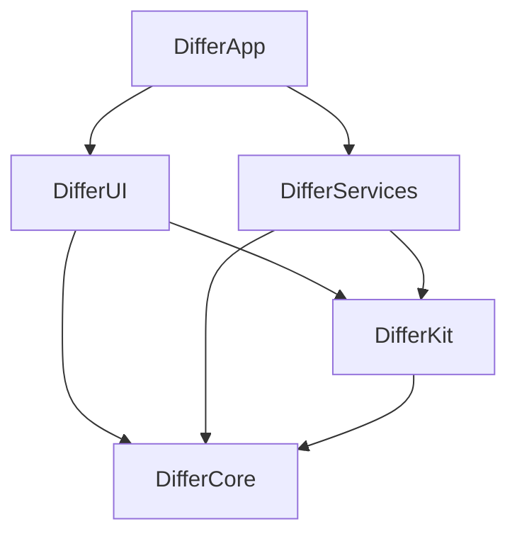

# Differ - Multimodule Architecture

## Module Structure

The project is organized into focused, reusable modules for better compilation times, testing, and maintainability:

```
Differ/
├── App/                    # Main application target
├── Modules/
│   ├── DifferCore/        # Core models, protocols, types
│   ├── DifferServices/    # Service implementations
│   ├── DifferUI/          # SwiftUI views and ViewModels
│   └── DifferKit/         # Public utilities and extensions
└── Tests/                 # Test targets per module
```

## Module Dependencies



## Module Descriptions

### 1. DifferCore
**Purpose:** Foundation types, models, and protocols  
**Dependencies:** None (pure Swift)  
**Exports:**
- Models: `SnapshotTest`, `DiffResult`, `TestRun`, `Repository`
- Protocols: Service contracts
- Enums: `TestStatus`, `DiffAlgorithm`, `SnapshotFramework`

**Why separate:** Core types should be dependency-free and reusable across all modules.

### 2. DifferServices
**Purpose:** Business logic and service implementations  
**Dependencies:** `DifferCore`, `DifferKit`, external SDKs  
**Exports:**
- `ImageComparisonService`
- `XCResultParser`
- `GitService`
- `TestRunner`

**Why separate:** Isolates heavy dependencies (XCResultKit, git) from UI and allows independent testing.

### 3. DifferUI
**Purpose:** SwiftUI views, ViewModels, and UI logic  
**Dependencies:** `DifferCore`, `DifferKit`, AppKit  
**Exports:**
- Views: `MainWindow`, `DiffView`, `TestListView`
- ViewModels: `DiffViewModel`, `TestListViewModel`
- UI utilities

**Why separate:** UI can be developed and previewed independently, enables faster iteration.

### 4. DifferKit
**Purpose:** Shared utilities, extensions, and helpers  
**Dependencies:** `DifferCore`  
**Exports:**
- Image utilities
- File system helpers
- Common extensions
- Logging utilities

**Why separate:** Reusable utilities can be shared across services and UI without circular dependencies.

### 5. DifferApp (Main Target)
**Purpose:** Application entry point and composition  
**Dependencies:** All modules  
**Exports:** Executable app  

**Why separate:** Thin layer that wires up modules, handles app lifecycle, and manages global state.

---

## Benefits of This Structure

### 1. **Compilation Speed**
- Modules compile in parallel
- Changes to one module don't force full recompilation
- Xcode builds only what changed

### 2. **Clear Dependencies**
- Enforced dependency graph prevents spaghetti code
- Easy to see what depends on what
- Prevents circular dependencies

### 3. **Better Testing**
- Test modules in isolation
- Mock dependencies easily
- Faster test execution

### 4. **Team Scalability**
- Different developers can work on different modules
- Reduces merge conflicts
- Clear ownership boundaries

### 5. **Reusability**
- Core models can be used in CLI tools, extensions
- Services can be reused in other apps
- UI components can be previewed independently

### 6. **Tuist Migration Path**
- Structure matches Tuist's project organization
- Easy to convert to `Project.swift` and module manifests
- Can add Tuist incrementally (one module at a time)

---

## Tuist Preparation (Not Yet Implemented)

When ready to migrate to Tuist, the structure supports:

1. **Project.swift** at root defining workspace
2. **Module manifests** in each Modules/ subdirectory
3. **Shared build settings** via Tuist ProjectDescriptionHelpers
4. **Dependency management** centralized in Tuist config
5. **Code generation** for resources and assets

Example future Tuist structure:
```
Differ/
├── Project.swift              # Main project definition
├── Workspace.swift            # Workspace with modules
├── Tuist/
│   ├── Config.swift
│   └── ProjectDescriptionHelpers/
├── Modules/
│   ├── DifferCore/
│   │   └── Project.swift      # Module definition
│   ├── DifferServices/
│   │   └── Project.swift
│   └── ...
```

---

## Migration Steps (Future)

When ready to adopt Tuist:

1. **Install Tuist**: `curl -Ls https://install.tuist.io | bash`
2. **Initialize**: `tuist init --platform macOS`
3. **Convert modules**: Create `Project.swift` for each module
4. **Define dependencies**: Map SPM deps to Tuist config
5. **Generate project**: `tuist generate`
6. **Remove Package.swift**: Tuist takes over project generation

---

## Current Implementation

For now, we use **local Swift Packages** as modules:
- Each module is a Swift Package in `Modules/`
- Root `Package.swift` declares them as dependencies
- Same benefits without Tuist overhead
- Zero-cost migration path to Tuist later

---

## Module Guidelines

### Adding New Code

**Is it a model or protocol?** → `DifferCore`  
**Is it a service implementation?** → `DifferServices`  
**Is it a view or ViewModel?** → `DifferUI`  
**Is it a utility or extension?** → `DifferKit`  
**Is it app composition/startup?** → `DifferApp`

### Dependency Rules

1. `DifferCore` depends on nothing (pure types)
2. `DifferKit` can depend on `DifferCore`
3. `DifferServices` can depend on `Core` + `Kit`
4. `DifferUI` can depend on `Core` + `Kit`
5. `DifferApp` can depend on everything

**Never:**
- Services depending on UI
- Circular dependencies between modules
- Platform-specific code in Core

---

## Testing Strategy

Each module has its own test target:
- `DifferCoreTests` - Model and protocol tests
- `DifferServicesTests` - Service unit tests with mocks
- `DifferUITests` - View and ViewModel tests
- `DifferKitTests` - Utility function tests
- `DifferAppTests` - Integration tests

Benefits:
- Fast focused tests
- Test modules in isolation
- Mock dependencies between modules
- Parallel test execution
